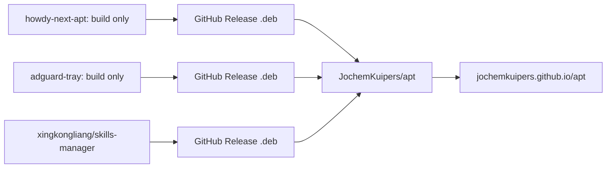

# Combined personal APT repository

This workspace becomes a **thin aggregator**. It does not contain howdy-next or adguard-tray packaging, and it does not need a skills-manager package tree. It downloads `.deb` files and publishes one signed GitHub Pages APT repo.

- GitHub: [JochemKuipers/apt](https://github.com/JochemKuipers/apt)
- Pages: `https://jochemkuipers.github.io/apt`




## This repo (skills-manager-apt → JochemKuipers/apt)

Layout:

```
scripts/fetch-debs.sh      # gh/curl latest .debs into out/
scripts/publish-apt.sh     # reprepro from out/ + existing pool
.github/workflows/publish.yml
README.md
```

`fetch-debs.sh` downloads:

- `gh release download -R JochemKuipers/howdy-next-apt` (latest `howdy-next_*.deb`)
- `gh release download -R JochemKuipers/adguard-tray` (latest `adguard-tray_*.deb`)
- `https://github.com/xingkongliang/skills-manager/releases/latest` assets `skills-manager_*_amd64.deb` and `*_arm64.deb` when they exist

No `packages/` directory. No rebuild of Howdy OpenCV here.

One workflow: schedule (daily is enough) + `workflow_dispatch`. Fetch → reprepro → deploy `gh-pages`. Skip republish if every fetched filename is already in `pool/`.

`publish-apt.sh` clones existing `gh-pages`, unions `pool/**/*.deb` with newly fetched debs, builds a fresh reprepro tree (drop `db/` and `conf/` from the published site), writes `jochem.sources` with embedded `Signed-By`, keyring, `.nojekyll`, `index.html`. Origin `Jochem Kuipers`, suite `stable`, archs `amd64 arm64`.

No `install.sh`. One DEB822 source file.

Secrets on `JochemKuipers/apt`: `APT_SIGNING_KEY`, `APT_SIGNING_KEY_PASSPHRASE` (reuse Howdy’s key or make a new “Jochem APT” key).

## Howdy-Next ([/home/jochem/Projects/Howdy-Next](/home/jochem/Projects/Howdy-Next))

Keep: `debian/`, Docker `ci-build.sh`, dep build scripts, weekly/dispatch build.

Delete / stop using:

- [scripts/publish-apt.sh](/home/jochem/Projects/Howdy-Next/scripts/publish-apt.sh)
- Pages deploy (`upload-pages-artifact`, `deploy-pages`, `pages: write`)
- Signing env (`APT_SIGNING_KEY`, keyring, `.sources` generation)
- `keyring.asc` if it is only for the old APT repo

Add: after a successful build, `softprops/action-gh-release` (or `gh release create`) with `out/howdy-next_*.deb` so this aggregator can fetch it. Howdy currently has no GitHub Releases.

README install section: point at `https://jochemkuipers.github.io/apt`. Keep the PAM / camera notes.

## adguard-tray ([/home/jochem/Projects/adguard-tray](/home/jochem/Projects/adguard-tray))

Keep: `debian/`, `packaging/fetch-upstream.sh`, `packaging/build-deb.sh`, `packaging/sync-upstream.sh`, changelog bump, lintian, **GitHub Release of the `.deb`** (already exists).

Delete:

- [packaging/publish-apt-repo.sh](/home/jochem/Projects/adguard-tray/packaging/publish-apt-repo.sh)
- [packaging/index.html](/home/jochem/Projects/adguard-tray/packaging/index.html)
- [install.sh](/home/jochem/Projects/adguard-tray/install.sh) (old Pages APT installer)
- GPG import + clone `gh-pages` + `peaceiris/actions-gh-pages` from [release.yml](/home/jochem/Projects/adguard-tray/.github/workflows/release.yml)
- APT signing secret docs in [packaging/README.md](/home/jochem/Projects/adguard-tray/packaging/README.md)

README: install via the combined APT source, not `curl | bash` against `jochemkuipers.github.io/adguard-tray`.

## After code lands (you)

1. Create empty GitHub repo `JochemKuipers/apt`, add signing secrets, Pages from `gh-pages`.
2. Push Howdy-Next / adguard-tray changes; run their build workflows so GitHub Releases exist.
3. Push this aggregator; run **Publish** once.
4. On machines:

```sh
curl -fsSL https://jochemkuipers.github.io/apt/jochem.sources \
  | sudo tee /etc/apt/sources.list.d/jochem.sources
sudo apt update
sudo apt install howdy-next adguard-tray skills-manager
```

Remove the old howdy-next / adguard-tray APT sources. Leave those GitHub repos in place as builders.